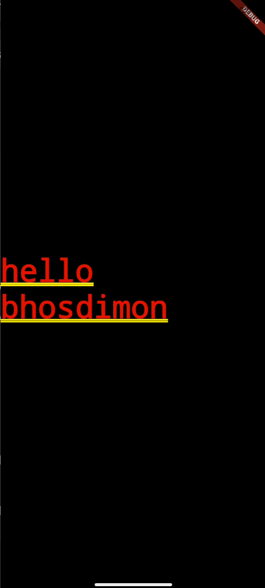

# Namer App

A minimal Flutter application that displays a centered greeting.

## Overview

This app is built with Flutter and Dart. The main screen shows a centered text:  
`hello bhosdimon`

## Getting Started

### Prerequisites

- [Flutter SDK](https://flutter.dev/docs/get-started/install)
- Dart (included with Flutter)
- Android Studio, VS Code, or another IDE

### Installation

1. **Clone the repository:**
   ```sh
   git clone https://github.com/yourusername/namer_app.git
   cd namer_app
   ```

2. **Install dependencies:**
   ```sh
   flutter pub get
   ```

3. **Run the app:**
   ```sh
   flutter run
   ```

## Project Structure

- `lib/main.dart` — Main application code
- `screenshots/` — App screenshots
- `android/`, `ios/`, `web/`, `windows/` — Platform-specific files

## Screenshot

| Home Screen |
|-------------|
|  |

## Dependencies

- [Flutter](https://flutter.dev/)
- [provider](https://pub.dev/packages/provider)
- [english_words](https://pub.dev/packages/english_words)

## License

This project is licensed under the MIT License.
```
This content matches your current project and code.